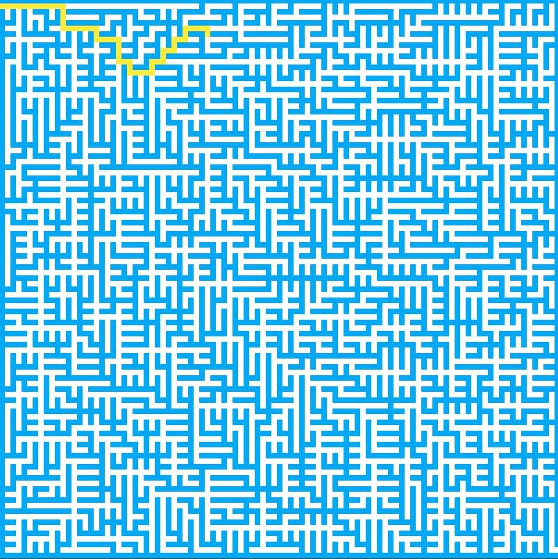
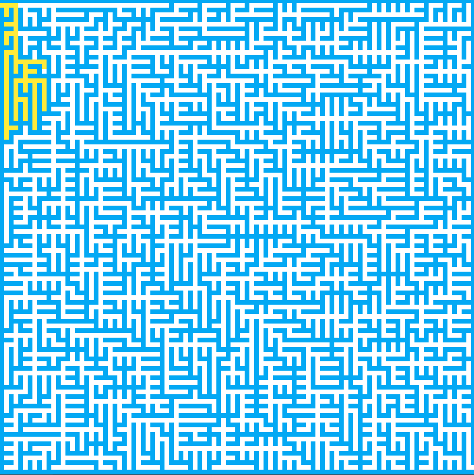
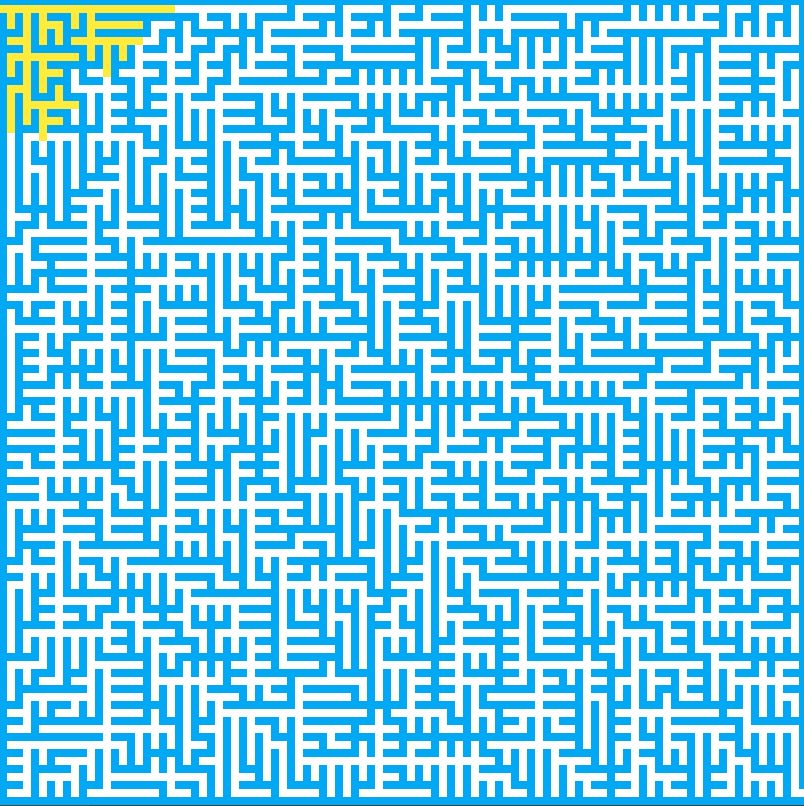

>Reference: 

# 算法可视化

采用MVC模式

Model 对应的数据由于差异性，需要每次修改

```java
/**
 * Viewer
 */
public class AlgoFrame extends JFrame {
```

```java
/**
 * Controller
 */
public class AlgoVisualizer {
```


## 随机模拟问题

### 一个有意思的分钱问题

房间里有100个人，每人都有100元钱，他们在玩一个游戏。每轮游戏中，每个人都要拿出一元钱随机给另一个人，最后这100个人的财富分布是怎样的？

>[Counterintuitive problem: Everyone in a room keeps giving dollars to random others. You’ll never guess what happens next.](http://www.decisionsciencenews.com/2017/06/19/counterintuitive-problem-everyone-room-keeps-giving-dollars-random-others-youll-never-guess-happens-next/)


1. 虽然可以缩小这个delay的值，但是缩小这个delay的值其实是有一定的限度的
    如果想快速的模拟很长时间以后，这个结果是怎样的，那么单纯的缩小这个delay 的值是没有用的

- [x] 现在的动画逻辑其实就相当于是每进行绘制一次，然后进行一轮游戏，每一次更新不仅仅更新一轮，而更新k 轮，这样就达到了加快模拟的目的

2. 那么钱最多的人，他的财富值将显示在我们的这个窗口的右侧，此时就能大概齐的看出来这个财富的分布；从大家都是一个水平慢慢的产生了变化，有了非常大的不同，而且这个变化整体呢还似乎不仅仅是线性的这里呢有一个弧度，它确实倾向于是一个幂指数这样的一个分布

    但是这里大家要注意一个问题，虽然这是一个幂指数的分布，不过由于已经排完序，所以其实每一次运行这个程序，这个所谓的财富最多的这个人，他不一定是同一个人，而是具有一定随机性的

- [x] 所以这个实验只能说明这样的模拟这个问题的结果会让财富成一个幂指数这样的形状进行分布，但这不代表每一次值最大的是同样一个人

```java
	// TODO: 编写自己的动画逻辑
    public void run(){

        while(true){

            // 改进2：是否排序
            Arrays.sort(money);
            frame.render(money);
            AlgoVisHelper.pause(DELAY);
            
            // 改进1：每一帧执行的轮数
            for(int k = 0 ; k < 50 ; k ++){
                for(int i = 0 ; i < money.length; i ++){
                    // 改进3：允许money为负值
                    //if(money[i] > 0){
                        int j = (int)(Math.random() * money.length);
                        money[i] -= 1;
                        money[j] += 1;
                    //}
                }
            }
        }
    }
```

事实上，这个模拟将一定呈现出这种不稳定的形式，而不会是呈现出最终大家所有的人的钱都是差不多的情况，那么这具体是什么原因呢，一个相对比较简单的解释是可以把这一百个人，每个人手里有多少的钱，这样的一个事情看作是一个状态，那么大家可以想象一下这个状态的数字是巨大的，有一百个人人在初始的情况下，每人有一百块钱，那么一共就一万块钱，那么状态总数其实就是将这一万块钱分给一百个人，一共有多少个分法，那么这是一个比较经典的数学问题，也可以看作是一个整数划分的问题，事实上这个状态的数量是非常大的，那么经过这种随机模拟之后，最终的结果一定是在这，随机的状态中的一个状态，那么在这里大家要注意，对于这个状态空间来说，所有的人的钱都差不多，这样的状态只是很小的一部分，而大部分状态一定呈现出，有的人的钱非常多，有的人的钱非常少，这样的一个不稳定的状态，只不过具体谁的钱多，谁的钱少是不一样的

也正因为如此，大家可以理解成，最终模拟出来的结果就是在这个状态空间中抽取一个状态，那么事实上得到的是一个不稳定的状态，这个概率是非常高的，那么刚才的这个解释呢不算非常的精确

> 事实上呢这是一个非常经典的物理学的热学研究的场景
> 在这样的一个空间中能量是固定的，那么在能量的传递过程中，最终的结果一定是，使得熵越来越大，那么熵这个概念实际上就是在描述这个空间中的无序程度，也就是这个空间将越来越无序
> 呈现出这样的状态

### 蒙特卡洛算法

通过大量的随机样本。来了解一个系统，进而得到所要计算的值

那么在这里大家要注意蒙特卡罗方法，使用大量的随机样本来去获得我们所要计算的这个值。但是获得的这个值不一定是真值。
而是一个近似值。那么事实上摩托卡罗方法就是利用这样的一个原理，在一些问题中我们可以使用大量的随机样本去模拟。
我们的样本量越大，最终模拟出来的值就相应的会越准确。

假设我们现在并不知道Π的值的话，希望你获得一个Π的近似值的话，那应该怎么做呢？
在这种时候我们就可以使用蒙特卡罗的方法。大家可以看在这个图中其实是一个正方形。在这个正方形中有一个直径和这个正方形的边长一样的圆。那么首先我们来看在这个图形中，圆和这个正方形之间的关系。

- 圆的面积=PI * R * R
- 方形面积=(2 * R) * (2 * R)=4 * R * R
- PI=4 * 圆 / 方

圆的面积，我们怎么获得呢？在这里就使用蒙特卡罗的方法来近似的模拟圆的面积。

在这个正方形中随机地打入一个点，那么这个点可能会落入⚪内，也可能会落入⚪外。那么如果打得点非常多的话，红色点的数量就可以近似的来表示圆的面积。而红色点加绿色点的数量就可以近似的来表示方的面积。


### 三门问题

参赛者会看见三扇关闭的门，其中有一扇门的后面呢是一辆汽车。相当于就是一个大奖。现在呢如果参赛者选中了后面有车的那扇门的话，就可以赢得这辆汽车。而另外的两扇门后面呢什么都没有。
但是在这里问题是参赛者不是简单的选一扇门，然后看自己中没中奖，而是有这样的一个环节。当参赛者选定一扇门的时候。在开启这扇门之前，主持人会先开启剩下的两扇门中的一扇门。并且呢这扇门的背后肯定是没有汽车的。比如说你选中了是a 门，于是主持人会开启，比如说b 门，并且告诉你b 门后头没有汽车。此时这个奖品要么在你选的这个a 门的后面，要么在剩下的这。这个c 门的后面现在主持人会问一个问题，给你另外一次机会，问你是否要改变你的选择。


```java
public class ThreeGatesExperiment {

    private int N;

    public ThreeGatesExperiment(int N){

        if(N <= 0)
            throw new IllegalArgumentException("N must be larger than 0!");

        this.N = N;
    }

    public void run(boolean changeDoor){

        int wins = 0;
        for(int i = 0 ; i < N ; i ++)
            if(play(changeDoor))
                wins ++;

        System.out.println(changeDoor ? "Change" : "Not Change");
        System.out.println("winning rate: " + (double)wins/N);
    }

    private boolean play(boolean changeDoor){

        // Door 0, 1, 2
        int prizeDoor = (int)(Math.random() * 3);
        int playerChoice = (int)(Math.random() * 3);

        if( playerChoice == prizeDoor)
            return changeDoor ? false : true;
        else
            return changeDoor ? true : false;
    }

    public static void main(String[] args) {

        int N = 10000000;
        ThreeGatesExperiment exp = new ThreeGatesExperiment(N);

        exp.run(true);
        System.out.println();
        exp.run(false);
    }
}
```

## 排序算法可视化

### Selection Sort


这个动画首先每一次在选择排序的过程中，都会去寻找后面未排序部分的一个最小值。而前面的部分则是已排序的部分。已排序的部分，以一种特殊的这种红色标识出来，而未排序的部分呢是这种灰色

第二点在扫描后面的这个未排序的数组的过程中，每次扫描都有一个浅蓝色的扫描的过程。同时在这个扫描的过程中。每一次当前找到的这个最小值，都用一种深蓝色表示出来

核心代码：

```java
    private void run(){

        setData(0, -1, -1);

        for( int i = 0 ; i < data.N() ; i ++ ){
            // 寻找[i, n)区间里的最小值的索引
            int minIndex = i;
            setData(i, -1, minIndex);

            for( int j = i + 1 ; j < data.N() ; j ++ ){
                setData(i, j, minIndex);

                if( data.get(j) < data.get(minIndex) ){
                    minIndex = j;
                    setData(i, j, minIndex);
                }
            }

            data.swap(i , minIndex);
            setData(i+1, -1, -1);
        }

        setData(data.N(),-1,-1);
    }

    // 一旦这个赋值完成之后，相应的也要发生一次绘制
    // 即一旦关注的那个变量发生改变，就进行一次渲染
    private void setData(int orderedIndex, int currentCompareIndex, int currentMinIndex){
        data.orderedIndex = orderedIndex;
        data.currentCompareIndex = currentCompareIndex;
        data.currentMinIndex = currentMinIndex;

        frame.render(data);
        AlgoVisHelper.pause(DELAY);
    }
```

选择排序是交换最少的排序。每一次都从后面被排序的部分选出一个最小的元素。和前面的元素进行交换。那么如果有n 个数据的话，选择排序只需要交换n 次。
即使是对于O(nlogn) 这样级别的排序算法，比如说归并排序、快速排序或者是堆排序，它所需要的交换次数。都不会像选择排序这样稳定在O(n)这个级别。

那么交换最少意味着什么？如果交换这个操作是非常耗时的话，选择排序就成为了最优的选择。

### Merge Sort

#### TopDown


```java
    public void run(){

        setData(-1, -1, -1);

        mergeSort(0, data.N()-1);

        setData(0, data.N()-1, data.N()-1);
    }

    private void mergeSort(int l, int r){

        if( l >= r )
            return;

        setData(l, r, -1);

        int mid = (l+r)/2;
        mergeSort(l, mid);
        mergeSort(mid+1, r);
        merge(l, mid, r);
    }
```

#### DownTop

自底向上的归并排序和自顶向下的归并排序的一个主要区别，TopDown可以保证每次划分都是平分的。
但是DownTop是没有这样保证的。尽管如此，这不意味着DownTop的性能比较差。虽然划分的不够平均，但是层数的差距最多只会差一层。而实际上自底向上的规定排序不需要使用递归算法。所以还减少了递归的开销。


```java
    public void run(){

        setData(-1, -1, -1);

        for (int sz = 1; sz < data.N(); sz *= 2)
            for (int i = 0; i < data.N() - sz; i += sz+sz)
                // 对 arr[i...i+sz-1] 和 arr[i+sz...i+2*sz-1] 进行归并
                merge(i, i+sz-1, Math.min(i+sz+sz-1,data.N()-1));

        this.setData(0, data.N()-1, data.N()-1);
    }
```

### QuickSort

**Partition**:


`i`遍历每一个元素，橙色的部分其实就是数组arr从i+1到 j 的，这一部分的元素都小于v 的，紫色的部分就是arr从j+1到 i-1 的部分。这一部分的元素都大于v。那么对于每一个索引i 位置的元素，分情况讨论，如果对于 e 来说，它是大于v 的。那么这是非常简单的一种情况，直接让这个元素**融入**紫色的部分。那么所谓的融入紫色的部分，其实就是直接`i++`。但是如果下一个待查找的元素e 如果是小于v 的话，那么会稍微复杂一些，将e 这个元素和紫色部分的第一个元素交换位置。而小于v 的部分扩展了一个蓝色的e。那么相应的这个分隔线的位置也发生了改变。所以 j 要相应的++。最终当遍历完了所有的元素之后。就要把这个红色的标定点放入到合适的位置。只需要将v 这个元素和橙色部分的最后一个元素交换一下位置

`j`所指向的位置是标定点所在的位置

**Pivot**: 每次都会将一个元素放到一个位置。这个位置前面的元素都小于它，后面的元素都大于它，这意味着什么？意味着这个元素就已经在了在排好序之后，他本来应该处在的位置。当排好序一个数组之后，随便抽出一个元素。那么这个元素前面的所有的元素一定小于这个元素，后面的所有元素一定大于这个元素。所以每一个曾经被当过这个标定点，也就是的这样的元素一旦放在了合适的位置，这个位置就不用动了。


```java
    private int partition(int l, int r){

        int v = data.get(l);
        setData(l, r, -1, l, -1);

        int j = l; // arr[l+1...j] < v ; arr[j+1...i) > v
        for( int i = l + 1 ; i <= r ; i ++ ){
            setData(l, r, -1, l, i);
            if( data.get(i) < v ){
                j ++;
                data.swap(j, i);
                setData(l, r, -1, l, i);
            }
        }

        data.swap(l, j);
        setData(l, r, j, -1, -1);

        return j;
    }
```

#### 数组元素几乎有序的情况

使partition失效，造成pivot处于两端位置，需要通过**Random Pivot**解决


```java
        int p = (int)(Math.random()*(r-l+1)) + l;
        setData(l, r, -1, p, -1);
```

#### 数组所有的元素都一致或者几乎一致的情况


**双路快速排序**


那么对于i 这个索引，从前向后扫描一个元素，而 j 这个索引是从后向前扫描一个元素。其停止条件都是包含等于的。所以对于i 这个索引`e>=v`的时候就停住。对于 j 这个索引`e>=v`的时候就停住。这个数组元素都是相等的元素的话，i 看一个元素，j 也看一个元素就停在了这里。此时这两个元素就发生了一次交换。那么其实这次交换完以后，由于这两个e 他们都等于v 所以其实整个数组的数据没有发生变化。但是 i 索引向后移动，j 索引也向前移动。那么通过这样的机制，i 索引就可以不断的向后移动。而 j 索引可以不断的。向前移动，使得最终橙色部分和紫色部分，其分割线的位置处在整个数组的中央的位置。让整个数组尽量平均的分成两部分，来避免单路的快速排序算法中。出现的面对相同的元素而退化成了O(n^2^) 的问题。

**三路快速排序**


```java
    private void quickSort3Ways(int l, int r){

        if( l > r )
            return;

        if( l == r ) {
            setData(l, r, l, -1, -1, -1);
            return;
        }

        setData(l, r, -1, -1, -1, -1);

        // 随机在arr[l...r]的范围中, 选择一个数值作为标定点pivot
        int p = (int)(Math.random()*(r-l+1)) + l;
        setData(l, r, -1, p, -1, -1);

        data.swap(l, p);
        int v = data.get(l);
        setData(l, r, -1, l, -1, -1);

        int lt = l;     // arr[l+1...lt] < v
        int gt = r + 1; // arr[gt...r] > v
        int i = l+1;    // arr[lt+1...i) == v
        setData(l, r, -1, l, lt, gt);

        while( i < gt ){
            if( data.get(i) < v ){
                data.swap( i, lt+1);
                i ++;
                lt ++;
            }
            else if( data.get(i) > v ){
                data.swap( i, gt-1);
                gt --;
            }
            else // arr[i] == v
                i ++;

            setData(l, r, -1, l, i, gt);
        }

        data.swap( l, lt );
        setData(l, r, lt, -1, -1, -1);

        // skip equals part
        quickSort3Ways(l, lt-1 );
        quickSort3Ways(gt, r);
    }
```

### HeapSort


```java
    public void run(){

        setData(data.N());

        // 建堆
        for( int i = (data.N()-1-1)/2 ; i >= 0 ; i -- ){
            shiftDown(data.N(), i);
        }

        // 堆排序
        for( int i = data.N()-1; i > 0 ; i-- ){
            data.swap(0, i);
            shiftDown(i, 0);
            setData(i);
        }

        setData(0);
    }

    /**
    其中n是来标识[0,n)是一个最大堆。由于整个最大堆的长度是在不断变化的，
    所以n来指示最大堆是在哪里结束的。
    */
    private void shiftDown(int n, int k){

        while( 2*k+1 < n ){
            int j = 2*k+1;
            if( j+1 < n && data.get(j+1) > data.get(j) )
                j += 1;

            if( data.get(k) >= data.get(j) )
                break;

            data.swap(k, j);
            setData(data.heapIndex);

            k = j;
        }
    }
```

## 迷宫求解问题

### DFS

回溯算法本身通常也都是使用递归，这种方式来实现的

所谓的回溯算法 ，从某种程度来源于其实就是相对比较高级的穷举的方法，所谓的高级，是因为对于某些问题，可能很难使用循环的方式来穷举所有可能，所以使用这种回溯的方式来穷举这些可能。



```java
    public void run(){

        setData(-1, -1, false);

        if(!go(data.getEntranceX(), data.getEntranceY()))
            System.out.println("The maze has NO solution!");

        setData(-1, -1, false);
    }

    // 从(x,y)的位置开始求解迷宫，如果求解成功，返回true；否则返回false
    private boolean go(int x, int y){

        if(!data.inArea(x,y))
            throw new IllegalArgumentException("x,y are out of index in go function!");

        data.visited[x][y] = true;
        setData(x, y, true);

        if(x == data.getExitX() && y == data.getExitY())
            return true;

        for(int i = 0 ; i < 4 ; i ++){
            int newX = x + d[i][0];
            int newY = y + d[i][1];
            if(data.inArea(newX, newY) &&
                    data.getMaze(newX,newY) == MazeData.ROAD &&
                    !data.visited[newX][newY])
                if(go(newX, newY))
                    return true;
        }

        // 回溯
        setData(x, y, false);

        return false;
    }
```


### Non Recursive DFS



```java
    private void run(){

        setData(-1, -1, false);

        Stack<Position> stack = new Stack<Position>();
        Position entrance = new Position(data.getEntranceX(), data.getEntranceY());
        stack.push(entrance);
        data.visited[entrance.getX()][entrance.getY()] = true;

        boolean isSolved = false;

        while(!stack.empty()){
            Position curPos = stack.pop();
            setData(curPos.getX(), curPos.getY(), true);

            if(curPos.getX() == data.getExitX() && curPos.getY() == data.getExitY()){
                isSolved = true;
                // 当找到出口，向前找到路径
                findPath(curPos);
                break;
            }

            for(int i = 0 ; i < 4  ; i ++){
                int newX = curPos.getX() + d[i][0];
                int newY = curPos.getY() + d[i][1];

                if(data.inArea(newX, newY)
                        && !data.visited[newX][newY]
                        && data.getMaze(newX, newY) == MazeData.ROAD){
                    stack.push(new Position(newX, newY, curPos));
                    data.visited[newX][newY] = true;
                }
            }

        }

        if(!isSolved)
            System.out.println("The maze has no Solution!");

        setData(-1, -1, false);
    }

    private void findPath(Position des){

        Position cur = des;
        while(cur != null){
            data.result[cur.getX()][cur.getY()] = true;
            cur = cur.getPrev();
        }
    }
```


### BFS



```java
    private void run(){

        setData(-1, -1, false);

        LinkedList<Position> queue = new LinkedList<Position>();
        Position entrance = new Position(data.getEntranceX(), data.getEntranceY());
        queue.addLast(entrance);
        data.visited[entrance.getX()][entrance.getY()] = true;

        boolean isSolved = false;

        while(queue.size() != 0){
            Position curPos = queue.pop();
            setData(curPos.getX(), curPos.getY(), true);

            if(curPos.getX() == data.getExitX() && curPos.getY() == data.getExitY()){
                isSolved = true;
                findPath(curPos);
                break;
            }

            for(int i = 0 ; i < 4  ; i ++){
                int newX = curPos.getX() + d[i][0];
                int newY = curPos.getY() + d[i][1];

                if(data.inArea(newX, newY)
                        && !data.visited[newX][newY]
                        && data.getMaze(newX, newY) == MazeData.ROAD){
                    queue.addLast(new Position(newX, newY, curPos));
                    data.visited[newX][newY] = true;
                }
            }

        }

        if(!isSolved)
            System.out.println("The maze has no Solution!");

        setData(-1, -1, false);
    }
```


### 联系

深度优先遍历和广度优先遍历的关系

- **DFS**

```
stack.add(入口)
while( !stack.empty())
curPos=stack.remove()
if(curPos==出口) break
对和curPos相邻的每一个可能的方向
if(newPos可达)
stack.add(newPos)
```

- **BFS**

```
queue.add(入口)
while( !queue.empty())
curPos=queue.remove()
if(curPos==出口) break
对和curPos相邻的每一个可能的方向
if(newPos可达)
queue.add(newPos)
```

## 迷宫生成问题

